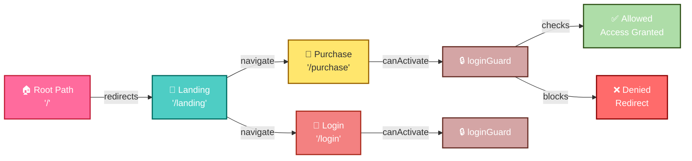
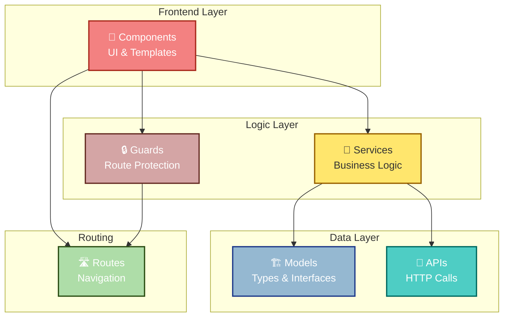
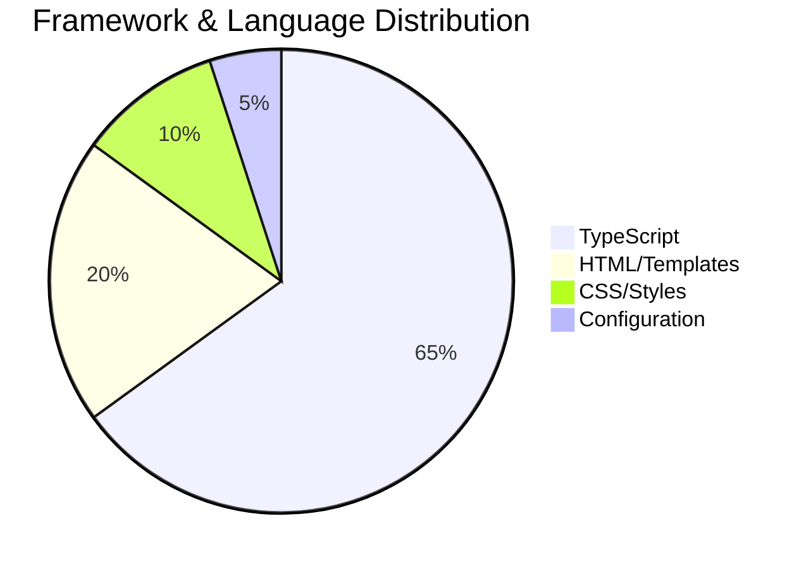

# 🎁 MagicBoxAssessment

> A modern Angular application built with the latest CLI and best practices. This project demonstrates an efficient and scalable architecture with component-based routing and guard-protected routes.

[](https://angular.dev)
[](https://www.typescriptlang.org)
[](https://vitest.dev)
[](LICENSE)

---

## 📋 Table of Contents

- [🚀 Quick Start](#-quick-start)
- [📁 Project Structure](#-project-structure)
- [🛣️ Routing System](#️-routing-system)
- [📦 Available Commands](#-available-commands)
- [🛠️ Development Guide](#-development-guide)
- [✅ Testing](#-testing)
- [📚 Additional Resources](#-additional-resources)

---

## 🚀 Quick Start

### Prerequisites
- Node.js (v18 or higher)
- npm or yarn

### Installation

```bash
# Clone the repository
git clone https://github.com/Ak-ram/magic-box-assessment.git

# Navigate to project directory
cd magic-box-assessment

# Install dependencies
npm install
```

### Running the Application

```bash
ng serve
```

Once the server is running, open your browser and navigate to:

```
http://localhost:4200/
```

The application will automatically reload whenever you modify any of the source files. ✨

---

## 📁 Project Structure

### Folder Tree Architecture

```mermaid
graph TD
    A["📦 magic-box-assessment"] --> B["📂 src"]
    A --> C["📂 public"]
    A --> D["📂 .vscode"]
    A --> E["⚙️ Configuration Files"]
    
    B --> B1["📂 app"]
    B --> B2["📂 assets"]
    B --> B3["📂 components"]
    B --> B4["📂 pages"]
    B --> B5["📂 services"]
    B --> B6["📂 models"]
    B --> B7["📂 guards"]
    B --> B8["📄 main.ts"]
    B --> B9["📄 index.html"]
    B --> B10["🎨 styles.css"]
    
    B1 --> B1A["📄 app.ts"]
    B1 --> B1B["📄 app.html"]
    B1 --> B1C["📄 app.routes.ts"]
    B1 --> B1D["📄 app.config.ts"]
    B1 --> B1E["📄 app.spec.ts"]
    
    B3 --> B3A["🧩 Reusable Components"]
    B4 --> B4A["📄 landing/"]
    B4 --> B4B["📄 purchase/"]
    B4 --> B4C["📄 login/"]
    
    B5 --> B5A["🔌 HTTP Services"]
    B6 --> B6A["🏗️ Data Models/Types"]
    B7 --> B7A["🔒 Route Guards"]
    
    E --> E1["📄 package.json"]
    E --> E2["📄 angular.json"]
    E --> E3["📄 tsconfig.json"]
    E --> E4["📄 .editorconfig"]
    
    style A fill:#FF6B9D,stroke:#C41E3A,stroke-width:3px,color:#fff
    style B fill:#4ECDC4,stroke:#006B62,stroke-width:2px,color:#fff
    style B1 fill:#95E1D3,stroke:#038373,stroke-width:2px,color:#333
    style B3 fill:#F38181,stroke:#AA2B1D,stroke-width:2px,color:#fff
    style B4 fill:#AEDDA8,stroke:#2D5016,stroke-width:2px,color:#fff
    style B5 fill:#FFE66D,stroke:#996200,stroke-width:2px,color:#333
    style B6 fill:#95B8D1,stroke:#1E3A8A,stroke-width:2px,color:#fff
    style B7 fill:#D4A5A5,stroke:#662D25,stroke-width:2px,color:#fff
```



### Directory Overview

| Directory | Purpose | Description |
|-----------|---------|-------------|
| **src/app** | 🎯 Core Application | Main application component, routing configuration, and app setup |
| **src/pages** | 📄 Page Components | Full-page components (Landing, Purchase, Login) |
| **src/components** | 🧩 Reusable Components | Shared UI components used across pages |
| **src/services** | 🔌 Business Logic | HTTP services, API calls, state management |
| **src/models** | 🏗️ Type Definitions | TypeScript interfaces and types |
| **src/guards** | 🔒 Route Protection | Route guards for authentication/authorization |
| **src/assets** | 🎨 Static Files | Images, fonts, and other static resources |
| **public** | 📦 Public Files | Publicly accessible files |
| **.vscode** | ⚙️ Editor Config | VSCode workspace settings and extensions |

---

## 🛣️ Routing System

### Route Architecture

The application uses **lazy-loaded components** with **route guards** for enhanced performance and security:



### Routes Configuration

| Route | Component | Status | Guard | Load Type |
|-------|-----------|--------|-------|-----------|
| **/** | Redirects to `/landing` | 🔄 Redirect | - | - |
| **/landing** | LandingComponent | 🟢 Active | - | Lazy |
| **/purchase** | PurchaseComponent | 🟢 Active | - | Lazy |
| **/login** | LoginComponent | 🔒 Protected | loginGuard | Lazy |

### Route Configuration Code

```typescript
// src/app/app.routes.ts
export const routes: Routes = [
  { 
    path: '', 
    redirectTo: 'landing', 
    pathMatch: 'full' 
  },
  {
    path: 'landing',
    loadComponent: () => import('../pages/landing/landing.component'),
  },
  {
    path: 'purchase',
    loadComponent: () => import('../pages/purchase/purchase.component'),
  },
  {
    path: 'login',
    loadComponent: () => import('../pages/login/login.component'),
    canActivate: [loginGuard],
  },
];
```

### Route Guards

**🔒 Login Guard** (`src/guards/login.guard.ts`)
- Protects the `/login` route
- Validates user authentication status
- Redirects to landing if unauthorized

---

## 📦 Available Commands

### Development Server
```bash
# Start the dev server with hot reload
ng serve

# Serve with production build
ng serve --configuration production
```

### Code Scaffolding
```bash
# Generate a new component
ng generate component component-name

# Generate a service
ng generate service service-name

# Generate a guard
ng generate guard guard-name

# See all available schematics
ng generate --help
```

### Building

```bash
# Build for production
ng build

# Build configuration details
# Output: dist/magic-box-assessment/

# The production build includes:
# ✅ Code minification
# ✅ Tree-shaking
# ✅ Optimized bundle size
# ✅ Source maps (optional)
```

### Testing

```bash
# Run unit tests with Vitest
ng test

# Run tests in watch mode
ng test --watch

# Run end-to-end tests
ng e2e
```

---

## 🛠️ Development Guide

### Project Architecture Pattern



### Creating a New Feature

1. **Create a Page Component**
   ```bash
   ng generate component pages/new-feature
   ```

2. **Create a Service**
   ```bash
   ng generate service services/new-feature
   ```

3. **Add Route**
   ```typescript
   {
     path: 'new-feature',
     loadComponent: () => import('../pages/new-feature/new-feature.component'),
   }
   ```

4. **Test Your Feature**
   ```bash
   ng test
   ```

---

## ✅ Testing

### Unit Tests with Vitest

```bash
# Run all tests
ng test

# Run tests in watch mode
ng test --watch

# Run with coverage report
ng test --coverage
```

### End-to-End Tests

```bash
# Run e2e tests
ng e2e

# Recommended frameworks:
# 🧪 Cypress
# 🎭 Playwright
# 🎪 Protractor (legacy)
```

### Test Structure

```
src/
├── app/
│   ├── app.spec.ts          # App component tests
│   └── app.routes.ts
├── pages/
│   └── **/*.spec.ts          # Page component tests
├── components/
│   └── **/*.spec.ts          # Component tests
└── services/
    └── **/*.spec.ts          # Service tests
```

---

## 📚 Additional Resources

### Official Documentation
- [Angular Documentation](https://angular.dev) - Official Angular guide
- [Angular CLI Documentation](https://angular.dev/tools/cli) - CLI commands and options
- [TypeScript Handbook](https://www.typescriptlang.org/docs) - TypeScript documentation
- [Vitest Documentation](https://vitest.dev/) - Testing framework guide

### Angular Best Practices
- [Angular Style Guide](https://angular.dev/guide/styleguide) - Code style recommendations
- [Angular Security Guide](https://angular.dev/guide/security) - Security best practices
- [Angular Performance Guide](https://angular.dev/guide/performance) - Optimization tips

### Tools & Extensions
- 🔧 Angular DevTools - Browser extension for debugging
- 📝 Prettier - Code formatter
- 🔍 ESLint - Code linter
- 🎨 PostCSS - CSS preprocessor

---

## 🚀 Project Statistics



---

## 📝 Configuration Files

| File | Purpose |
|------|---------|
| `angular.json` | Angular CLI configuration |
| `tsconfig.json` | TypeScript compiler settings |
| `package.json` | Project dependencies & scripts |
| `.editorconfig` | Code editor configuration |
| `.prettierrc` | Code formatter configuration |
| `.postcssrc.json` | PostCSS configuration |

---

## 🤝 Contributing

When contributing to this project, please follow these guidelines:

1. Create a feature branch from `master`
2. Commit your changes with clear messages
3. Push to the branch
4. Submit a pull request

---

## 📄 License

This project is licensed under the MIT License - see the LICENSE file for details.

---

## 👨‍💻 Author

**Ak-ram** - [GitHub Profile](https://github.com/Ak-ram)

---

<div align="center">

### ⭐ If you find this project helpful, please consider giving it a star!

**Made with ❤️ using Angular & TypeScript**

</div>
