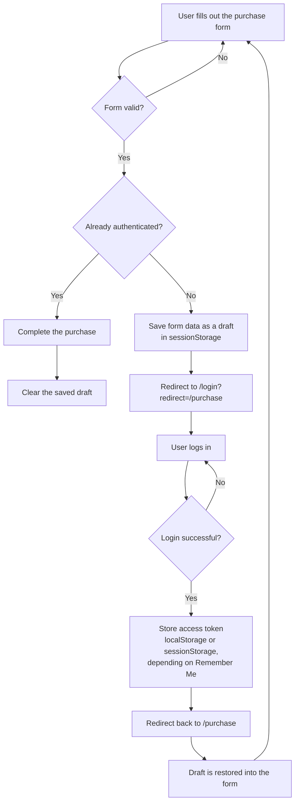

# Magic Box 🎁

> [!NOTE]
> Live demo: [magic-box-assessment](https://magic-box-assessment.vercel.app/)


> [!IMPORTANT]
> *RememberMe* checkbox
> - if `checked` : Your token will be stored in `localeStorage`. so you will be logged in even if you close the tab.
> 
>
> - if `unchecked` : Your token will be stored in `sessionStorage`. so you will be logged out once your session ends (close tab)
> 
>
> - After `1 min`, your token will expire, so you must login again.

> [!IMPORTANT]
> - If `non-auth` user fill & submit *purchase form*, his data will be save as `draft` & he will be redirected to `login` page.
> 
> - After he logged in successfully, he will be redirected back to `/purchase` page to continue payment.
---


<details>
    <summary> 📦Packages List</summary>
<br/>
    
- `Angular 21`
- `TailwindCSS`
- `DummyJSON`
- `Karma + Jasmine`
</details>

<details>
    <summary>📁 Project Structure</summary>
<br/>

```
src/
├── app/
│   ├── app.config.ts        
│   ├── app.routes.ts        
│   ├── app.ts               
│   └── app.spec.ts
│
├── components/
│   ├── header/
│   │   ├── header.component.ts     
│   │   └── header.component.html
│   └── summary-card/
│       ├── summary-card.component.ts   
│       └── summary-card.component.html
│
├── guards/
│   └── login.guard.ts        
│
├── models/
│   └── auth.model.ts         
│
├── pages/
│   ├── landing/               
│   ├── login/                
│   └── purchase/             
│
└── services/
   ├── auth.service.ts       
   └── purchase.service.ts  
```
</details>

## 🧭 Fill first, Authenticate later flow 

```mermaid
flowchart TD
   A[User fills out the purchase form] --> B{Form valid?}
   B -- No --> A
   B -- Yes --> C{Already authenticated?}
   C -- Yes --> D[Complete the purchase]
   D --> E[Clear the saved draft]
   C -- No --> F[Save form data as a draft<br/>in sessionStorage]
   F --> G[Redirect to /login?redirect=/purchase]
   G --> H[User logs in]
   H --> I{Login successful?}
   I -- No --> H
   I -- Yes --> J[Store access token<br/>localStorage or sessionStorage,<br/>depending on Remember Me]
   J --> K[Redirect back to /purchase]
   K --> L[Draft is restored into the form]
   L --> A
```
