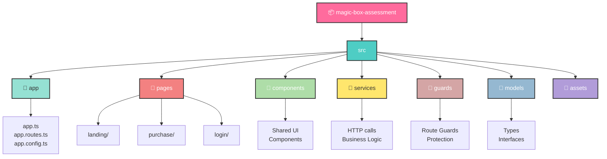
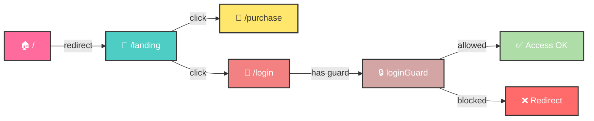
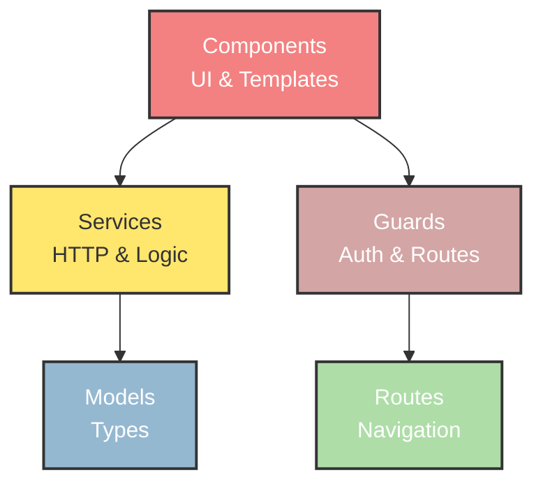

# Magic Box Assessment

Angular app with clear structure, routing, and guards. Get it running and explore the code.

---

## Quick Start

**Need:**
- Node.js 18+
- npm or yarn

**Run it:**
```bash
git clone https://github.com/Ak-ram/magic-box-assessment.git
cd magic-box-assessment
npm install
ng serve
```
→ Open http://localhost:4200

---

## Folder Structure


```mermaid
graph TD
    A["📦 magic-box-assessment"] --> B["src"]
    B --> B1["📂 app"]
    B --> B2["📂 pages"]
    B --> B3["📂 components"]
    B --> B4["📂 services"]
    B --> B5["📂 guards"]
    B --> B6["📂 models"]
    B --> B7["📂 assets"]
    
    B1 --> B1A["app.ts<br/>app.routes.ts<br/>app.config.ts"]
    B2 --> B2A["landing/"]
    B2 --> B2B["purchase/"]
    B2 --> B2C["login/"]
    
    B3 --> B3A["Shared UI<br/>Components"]
    B4 --> B4A["HTTP calls<br/>Business Logic"]
    B5 --> B5A["Route Guards<br/>Protection"]
    B6 --> B6A["Types<br/>Interfaces"]
    
    style A fill:#FF6B9D,stroke:#333,stroke-width:2px,color:#fff
    style B fill:#4ECDC4,stroke:#333,stroke-width:2px,color:#fff
    style B1 fill:#95E1D3,stroke:#333,stroke-width:2px,color:#333
    style B2 fill:#F38181,stroke:#333,stroke-width:2px,color:#fff
    style B3 fill:#AEDDA8,stroke:#333,stroke-width:2px,color:#fff
    style B4 fill:#FFE66D,stroke:#333,stroke-width:2px,color:#333
    style B5 fill:#D4A5A5,stroke:#333,stroke-width:2px,color:#fff
    style B6 fill:#95B8D1,stroke:#333,stroke-width:2px,color:#fff
    style B7 fill:#B19CD9,stroke:#333,stroke-width:2px,color:#fff
```

**What goes where:**

| Folder | What's inside |
|--------|---------------|
| `app/` | Routes, config, main component |
| `pages/` | Landing, Purchase, Login pages |
| `components/` | Reusable UI pieces |
| `services/` | API calls & logic |
| `guards/` | Route protection rules |
| `models/` | TypeScript types |
| `assets/` | Images, fonts, etc |

---

## Routes & Navigation


```mermaid
graph LR
    A["🏠 /"] -->|redirect| B["🎯 /landing"]
    B -->|click| C["🛒 /purchase"]
    B -->|click| D["🔐 /login"]
    
    D -->|has guard| E["🔒 loginGuard"]
    E -->|allowed| F["✅ Access OK"]
    E -->|blocked| G["❌ Redirect"]
    
    style A fill:#FF6B9D,stroke:#333,stroke-width:2px,color:#fff
    style B fill:#4ECDC4,stroke:#333,stroke-width:2px,color:#fff
    style C fill:#FFE66D,stroke:#333,stroke-width:2px,color:#333
    style D fill:#F38181,stroke:#333,stroke-width:2px,color:#fff
    style E fill:#D4A5A5,stroke:#333,stroke-width:2px,color:#fff
    style F fill:#AEDDA8,stroke:#333,stroke-width:2px,color:#fff
    style G fill:#FF6B6B,stroke:#333,stroke-width:2px,color:#fff
```

**Routes:**
- `/` → redirects to `/landing`
- `/landing` → public, no guard
- `/purchase` → lazy loaded
- `/login` → protected by `loginGuard`
- `**` → unknown routes → `/landing`

**Code:**
```typescript
// src/app/app.routes.ts
export const routes: Routes = [
  { path: '', redirectTo: 'landing', pathMatch: 'full' },
  { path: 'landing', loadComponent: () => import('../pages/landing/landing.component') },
  { path: 'purchase', loadComponent: () => import('../pages/purchase/purchase.component') },
  { path: 'login', loadComponent: () => import('../pages/login/login.component'), canActivate: [loginGuard] },
  { path: '**', redirectTo: 'landing' },
];
```

---

## Packages & Dependencies


```mermaid
graph TD
    A["📦 Dependencies"] --> A1["Angular Core<br/>@angular/core ^21.2.0"]
    A --> A2["Angular Router<br/>@angular/router ^21.2.0"]
    A --> A3["Angular Forms<br/>@angular/forms ^21.2.0"]
    A --> A4["Angular Common<br/>@angular/common ^21.2.0"]
    A --> A5["Angular Platform<br/>@angular/platform-browser ^21.2.0"]
    A --> A6["Angular Compiler<br/>@angular/compiler ^21.2.0"]
    A --> A7["RxJS<br/>~7.8.0"]
    A --> A8["tslib<br/>^2.3.0"]
    
    B["🛠️ DevDependencies"] --> B1["Angular CLI<br/>@angular/cli ^21.2.19"]
    B --> B2["Angular Build<br/>@angular/build ^21.2.19"]
    B --> B3["Tailwind CSS<br/>tailwindcss ^4.1.12"]
    B --> B4["PostCSS<br/>postcss ^8.5.3"]
    B --> B5["TypeScript<br/>~5.9.2"]
    B --> B6["Prettier<br/>^3.8.1"]
    B --> B7["Jasmine & Karma<br/>jasmine-core ^6.3.0"]
    B --> B8["Zone.js<br/>^0.16.2"]
    
    style A fill:#4ECDC4,stroke:#333,stroke-width:2px,color:#fff
    style A1 fill:#FF6B9D,stroke:#333,stroke-width:2px,color:#fff
    style A2 fill:#FFE66D,stroke:#333,stroke-width:2px,color:#333
    style A3 fill:#F38181,stroke:#333,stroke-width:2px,color:#fff
    style A4 fill:#AEDDA8,stroke:#333,stroke-width:2px,color:#fff
    style A5 fill:#95B8D1,stroke:#333,stroke-width:2px,color:#fff
    style A6 fill:#B19CD9,stroke:#333,stroke-width:2px,color:#fff
    style A7 fill:#D4A5A5,stroke:#333,stroke-width:2px,color:#fff
    style A8 fill:#95E1D3,stroke:#333,stroke-width:2px,color:#333
    
    style B fill:#FF9E64,stroke:#333,stroke-width:2px,color:#fff
    style B1 fill:#FF6B9D,stroke:#333,stroke-width:2px,color:#fff
    style B2 fill:#FFE66D,stroke:#333,stroke-width:2px,color:#333
    style B3 fill:#F38181,stroke:#333,stroke-width:2px,color:#fff
    style B4 fill:#AEDDA8,stroke:#333,stroke-width:2px,color:#fff
    style B5 fill:#95B8D1,stroke:#333,stroke-width:2px,color:#fff
    style B6 fill:#B19CD9,stroke:#333,stroke-width:2px,color:#fff
    style B7 fill:#D4A5A5,stroke:#333,stroke-width:2px,color:#fff
    style B8 fill:#95E1D3,stroke:#333,stroke-width:2px,color:#333
```

**Production Dependencies:**

| Package | Version | Purpose |
|---------|---------|---------|
| `@angular/core` | ^21.2.0 | Angular core framework |
| `@angular/router` | ^21.2.0 | Client-side routing |
| `@angular/forms` | ^21.2.0 | Form handling |
| `@angular/common` | ^21.2.0 | Common directives & pipes |
| `@angular/platform-browser` | ^21.2.0 | Browser platform |
| `@angular/compiler` | ^21.2.0 | Template compiler |
| `rxjs` | ~7.8.0 | Reactive programming |
| `tslib` | ^2.3.0 | TypeScript helpers |

**Dev Dependencies:**

| Package | Version | Purpose |
|---------|---------|---------|
| `@angular/cli` | ^21.2.19 | Command-line tools |
| `@angular/build` | ^21.2.19 | Build tools |
| `tailwindcss` | ^4.1.12 | Utility-first CSS |
| `@tailwindcss/postcss` | ^4.1.12 | PostCSS plugin for Tailwind |
| `postcss` | ^8.5.3 | CSS transformations |
| `typescript` | ~5.9.2 | TypeScript compiler |
| `prettier` | ^3.8.1 | Code formatter |
| `jasmine-core` | ^6.3.0 | Testing framework |
| `karma` | ^6.4.4 | Test runner |
| `zone.js` | ^0.16.2 | Zone management |

---

## Commands

**Dev**
```bash
ng serve               # Start dev server
ng generate component ComponentName    # New component
ng generate service ServiceName        # New service
ng generate guard GuardName            # New guard
```

**Build & Test**
```bash
ng build --configuration production    # Production build
ng test                                # Unit tests (Jasmine/Karma)
ng e2e                                 # E2E tests
```

---

## Architecture


```mermaid
graph TB
    A["Components<br/>UI & Templates"] --> B["Services<br/>HTTP & Logic"]
    A --> C["Guards<br/>Auth & Routes"]
    B --> D["Models<br/>Types"]
    C --> E["Routes<br/>Navigation"]
    
    style A fill:#F38181,stroke:#333,stroke-width:2px,color:#fff
    style B fill:#FFE66D,stroke:#333,stroke-width:2px,color:#333
    style C fill:#D4A5A5,stroke:#333,stroke-width:2px,color:#fff
    style D fill:#95B8D1,stroke:#333,stroke-width:2px,color:#fff
    style E fill:#AEDDA8,stroke:#333,stroke-width:2px,color:#fff
```

---

## Tips

- Pages use **lazy loading** → faster startup
- Keep **services small** & focused
- Add `.spec.ts` tests next to your code
- Route guards = **auth protection**

---

## Contribute

1. Create feature branch
2. Make small commits
3. Push & send PR

---

MIT License | Author: [Ak-ram](https://github.com/Ak-ram)
